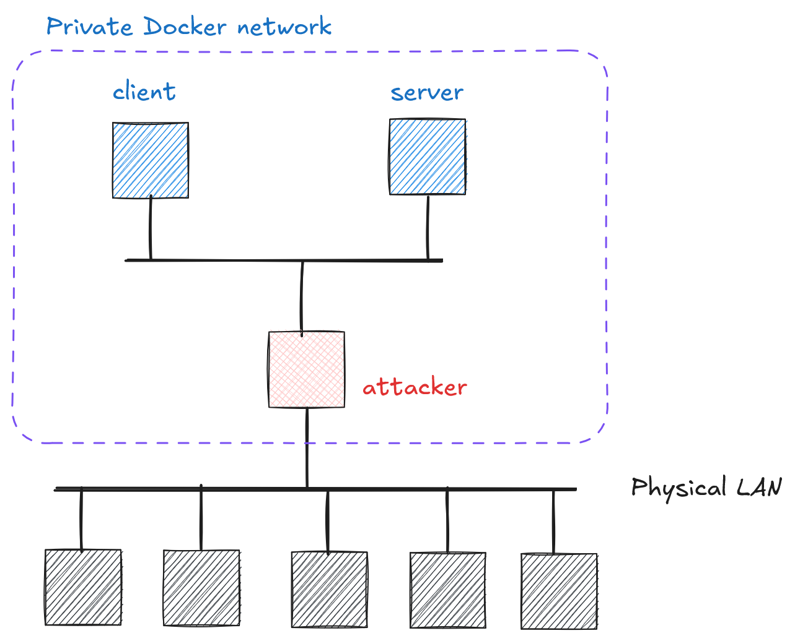

# Cryptography and Network Security <!-- omit in toc -->

# Lab 2: Man-in-the-middle attack <!-- omit in toc -->

## Introduction

In this lab, we will explore fundamental security threats and vulnerabilities in computer networks. Specifically, we will analyze how compromising the integrity of Address Resolution Protocol (ARP) messages enables an attacker to perform Man in the Middle (MitM) attacks on computers sharing a local area network (LAN, WLAN). By actively manipulating ARP messages, an attacker can intercept and potentially modify communication between network hosts.

## Network Topology

For this lab, you will work with the following network setup:

  

## Challenge Description

The server implements an authenticated REST API service (source code available in [`code/arp/`](../code/arp/)). The client application regularly communicates with this service. Your goal is to capture a flag in the format `crypto{th1s_is_y0ur_f1ag}`.

### Hints

1. The source code in the [`code/arp/`](../code/arp/) directory help understanding how the `client` and `server` communicate.
2. Look carefully at the bearer token in the HTTP Authorization header - it contains more than just access rights.
3. Lecture slides on ARP poisoning provide theoretical foundation.
4. Your attacking machine comes with pre-installed tools that will help you:
- `ifconfig` - tool for network interface configuration and inspection
- `dsniff` - suite of tools for network auditing and penetration testing
- `tcpdump` - command-line packet analyzer (use `-vvAls0` flags for detailed payload decoding)
    > Using Linux pipes (`|`) with `grep` tool can be particularly useful for filtering decoded `tcpdump` output.
1. Being multi-homed means your attacking machine has multiple network interfaces. Use `ifconfig` to identify the correct one for capturing/spoofing.
2. You might find [CyberChef](https://gchq.github.io/CyberChef/) quite useful.
