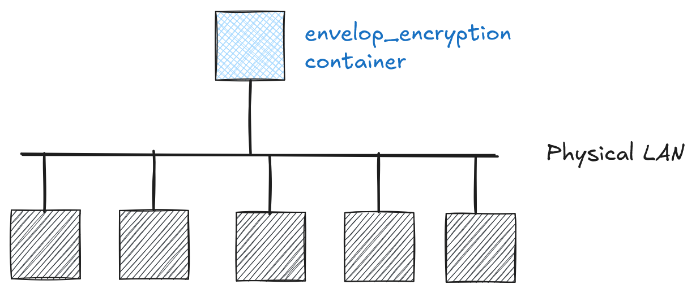

# Cryptography and Network Security <!-- omit in toc -->

# Lab 6: Hybrid/Envelope Encryption using RSA and AES <!-- omit in toc -->

## Introduction

This lab demonstrates hybrid/envelope encryption, a fundamental cryptographic construction that uses multiple keys to secure data. In this implementation, we combine RSA for key encryption and AES for data encryption.

### What is Envelope Encryption?

Envelope encryption is a cryptographic system that uses two or more keys to secure a message:
1. A long-term static key (in our case, an RSA key pair)
2. A per-message key (in our case, an AES key) generated specifically for each message

The envelope is constructed by:
1. Generating a per-message key (msgKey) for the data
2. Encrypting the message: ciphertext = Encrypt(msgKey, message)
3. Encrypting the message key with the long-term key: encKey = Encrypt(k, msgKey)
4. Combining (encKey, ciphertext) into a single envelope structure

In our implementation:
- The per-message key is an AES key (DEK - Data Encryption Key)
- The long-term static key is an RSA key pair (KEK - Key Encryption Key)
- The envelope consists of (encrypted_aes_key, iv, ciphertext)

### Key Benefits

1. **Protecting data keys**: When you encrypt a data key, you don't have to worry about storing the encrypted data key, because the data key is inherently protected by encryption. You can safely store the encrypted data key alongside the encrypted data.

2. **Encrypting the same data under multiple keys**: Encryption operations can be time consuming, particularly when the data being encrypted are large objects. Instead of re-encrypting raw data multiple times with different keys, you can re-encrypt only the data keys that protect the raw data.

3. **Combining the strengths of multiple algorithms**: In general, symmetric key algorithms are faster and produce smaller ciphertexts than public key algorithms. But public key algorithms provide inherent separation of roles and easier key management. Envelope encryption lets you combine the strengths of each strategy.


Source: [AWS KMS Cryptographic Details](https://docs.aws.amazon.com/kms/latest/developerguide/kms-cryptography.html)

## Network Topology

The network topology for this lab is given in the image below.

<p align="center">
  
</p>

## Challenge Description

Your task is to recover a `flag` that has been secured using hybrid/envelope encryption. You will be provided with:

1. A challenge file (`challenge.txt` located in your home directory) containing:
   - RSA public modulus (n)
   - Public exponent (e)
   - One prime factor (p) of the RSA modulus
   - Encrypted AES key
   - Initialization vector (IV)
   - Ciphertext

The challenge involves:
1. Reconstructing the RSA private key:
   - You have one prime factor (p)
   - Calculate the second prime factor (q) using n
   - Derive the private exponent (d)
   - Construct the complete RSA private key

2. Decrypting the envelope:
   - Use the reconstructed private key to decrypt the AES key
   - Use the decrypted AES key and provided IV to decrypt the ciphertext and recover your `flag`

## Hints

1. Check relevant parts of the source code used to prepare this challenge: [`code/envelope_encryption/`](../code/envelope_encryption/)
2. Python [cryptography library](https://cryptography.io) can help with both RSA key reconstruction and decryption. In particular, the following code snippet is quite relevant:

    ```python
    private_key = rsa.RSAPrivateNumbers(
        p=p,
        q=q,
        d=d,
        dmp1=pow(e, -1, p-1),
        dmq1=pow(e, -1, q-1),
        iqmp=pow(q, -1, p),
        public_numbers=rsa.RSAPublicNumbers(e=e, n=n)
    ).private_key(default_backend())
    ```
3. Some parts of the challenge data are base64-encoded, while others are in hexadecimal—make sure to decode them properly (refer to the source code for details).