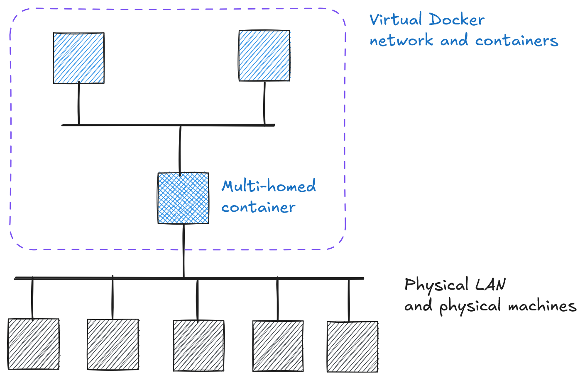

# Cryptography and Network Security <!-- omit in toc -->

# Lab 1: Setting up the stage

## Introduction

Each student is assigned a personalized [Docker](https://www.docker.com/) network and a set of Docker *containers* (see the image below). To access and interact with this private network, a special multi-homed container is provided. This container is personalized for each student and serves as a bridge between the Docker network and the physical laboratory network.  

<p align="center">
  
</p>

Since all machines are dynamically assigned IP addresses, the IP of your multi-homed container may change. When needed, you can always check the current IP address at **[http://containersinfo.local](http://containersinfo.local).**   

> **IMPORTANT:** Your physical machine (laptop) must be connected to the physical LAN via a cable. Connecting via WiFi will not work, and you won't be able to access any containers.

### Accessing a multi-homed container  

Each multi-homed container runs a Secure Shell (SSH) server, allowing you to establish a remote session. To log into it, use a `username` derived from your name, as shown in the table below:  

| First Name  | Last Name      | `username`              |
|------------|---------------|-------------------------|
| Ivana      | Ivić          | `ivic_ivana`           |
| Marko Ivan | Marković      | `markovic_marko_ivan`  |
| Mirta      | Marić Banje   | `maric_banje_mirta`    |

Your `password` is embedded in the captured flag: `crypto{th1s_is_y0ur_f1ag_and_passw0rd}`

## Unlocking the stage: Capture your initial flag

In this initial lab, a special central Docker container emits interesting information into the physical LAN network. You can use this information to recover your initial flag. The flag will grant you access to your personalized network and allow you to progress to the next challenge.

Since the purpose of these labs is to encourage exploration and independent problem-solving, we will provide only the most essential details. It is up to you to find your own way to solve the lab and discover the flag.

Having captured your first flag, you can confirm its validity by attempting to log into your personalized multi-homed container using the Secure Shell client `ssh`.

### Hints for Students:

1. We are using the Shamir Secret Sharing System to process the initial flag.
2. Below is a part of a config file used by the special container that emits interesting information to the physical LAN:
    ```yaml
    shamir_secret_sharing:
        shares: 8
        threshold: 2             # Selected at random
    broadcast:
        address: "239.255.15.0"  # UDP broadcast address
        port: 1900               # Standard SSDP port
    ```

3. The `ssss` tool in Linux is used to handle secret sharing. All students can access a shared Docker container that hosts this tool. To access it, use `ssh` client with the following credentials: `user:user`.

4. Finally, here is a part of the configuration file used by the special container that emits interesting information over the physical LAN:
    ```yaml
    shamir_secret_sharing:
        shares: 8
        threshold: 2             # Selected at random
    broadcast:
        address: "239.255.15.0"  # UDP broadcast address
        port: 1900               # Standard SSDP port
    ```