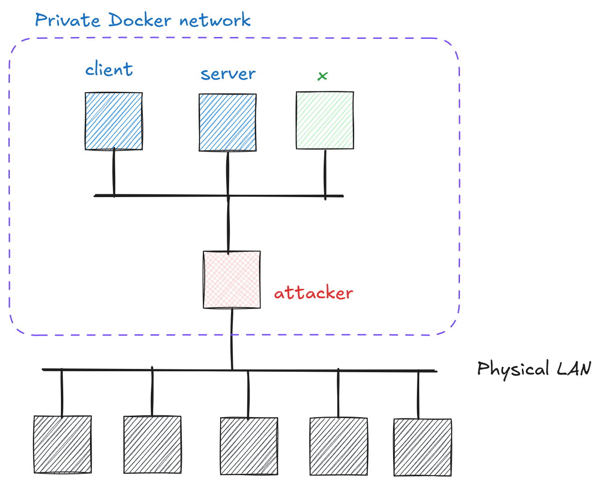

# Cryptography and Network Security <!-- omit in toc -->

# Lab 5: How weak secrets defeat strong encryption <!-- omit in toc -->

## Introduction

This lab demonstrates how low-entropy secrets, such as weak passwords or predictable keys, undermine normally strong cryptographic mechanisms.

## Network Topology

The network topology for this lab is given in the image below.

<p align="center">
  
</p>

The server implements a session management service with `/login` and `/protected` endpoints. The client authenticates with the server and periodically accesses the `/protected` endpoint. An unidentified station (x) provides an encryption service that secures a flag.

## Challenge Description

Your task is to exploit the weak entropy in the session management system to gain access to the `/protected` endpoint, learn useful information, and use it to recover the flag.

> **Two-stage attack:**
> 1. Session ID Attack:
>    - Analyze session ID generation pattern
>    - Try to guess a session ID used by the authenticated client station
>    - Access protected endpoint and learn useful info
> 
> 2. Flag Decryption:
>    - Analyze the encryption mode and key generation pattern
>    - Get the corresponding ciphertext
>    - Decrypt the flag


## Hints

1. Check the source code in [`code/low_entropy/`](../code/low_entropy/)
2. Local port forwarding: `ssh -L 80:server:80 your_name@your_attacker_IP`
3. Python `requests` package can be handy:
    
    ```python
    import requests

    cookies = {
        "session_id": "YOUR_SESSION_ID_HERE"
    }
    
    response = requests.get(f"http://server/protected", cookies=cookies)
    ```    
4. Access to server's REST API is rate-limited with the following config:

    ```yaml
    rate_limit:
        enabled: true
        window_seconds: 1
        max_requests: 10
        per_ip: true
        ban_duration_minutes: 1
    ```
5. Be patient.