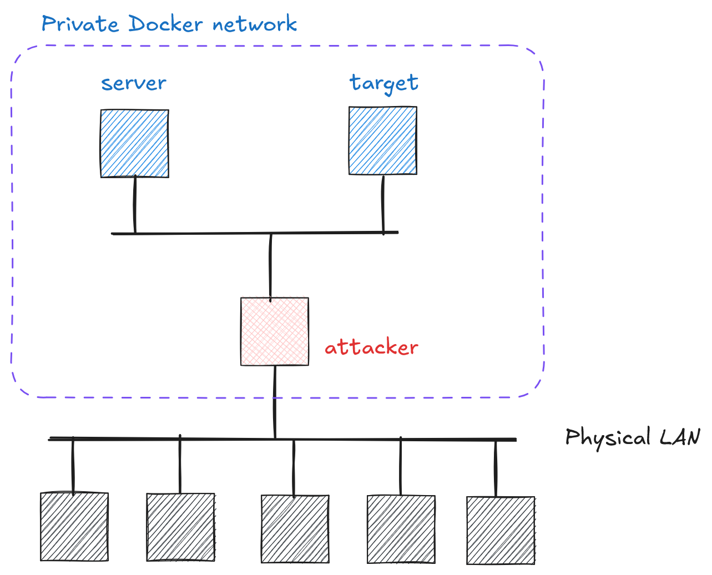

# Cryptography and Network Security <!-- omit in toc -->

# Lab 8: Some practical uses of cryptographic hash functions

## Introduction

In this lab, you will explore several practical applications of cryptographic hash functions that are widely used in modern systems. You will learn how hash functions are used in generating JSON Web Tokens (JWT) for secure authentication and authorization, experience cryptocurrency mining by solving cryptographic puzzles similar to those used in Bitcoin (finding values of x such that H(x + challenge) starts with a specific number of zeros), and understand how hash functions are utilized for securely storing passwords.

> **IMPORTANT**: This lab might feel a bit overwhelming, but please give it your best effort and keep pushing forward! Help each other and try to learn something new.

## Network topology

<p align="center">
  
</p>

The `server` implements a REST API service with the following key endpoints:

1. Proof-of-Work Mining Challenge:
   - `/challenge`: Gets a new mining challenge (random hex string)
   - `/verify-solution`: Verifies if a provided nonce solves the challenge (hash of nonce+challenge must start with specified number of zeros)

2. Protected Resource:
   - `/protected`: Returns next-step credentials and hint; available only after solving the mining challenge.


> **IMPORTANT (JWT Authentication)**: All endpoints are protected by JWT tokens that must include specific claims (expiration time, issue time, issuer, role and username).

The `target` host holds your flag (for more details you will need the hint from the `server`).

## Challenge Description

In this lab, you will complete the following tasks:

1. **JWT Token Creation**: Create and sign a JWT token with the required claims to authenticate with the server. You'll need to:
   - Include standard claims: expiration time (exp), issue time (iat), and issuer (iss)
   - Add custom claims: role="student" and your username (e.g., doe_john)
   - Sign the token using HMAC-SHA256 (HS256) algorithm; recall HMAC requires a secret
   - As a secret to sign JWT you will use the `flag` from the last lab (the same one used to login to the `attacker` host)
   - Required claims (issue and expiration times obviously should be adjusted, as well as the username):

        ```json
        {
            "iat": 1747417715,
            "exp": 1747421315,
            "iss": "https://auth.fesb.hr",
            "role": "student",
            "username": "doe_john"
        }
        ``` 
    - The `server` expects a valid token to be included in the authorization header:
        ```python 
        headers = {"Authorization": f"Bearer {token}"} 
        ```

2. **Cryptocurrency Mining Simulation**: Implement a proof-of-work mining algorithm:
   - Request a challenge from the server (read path `/challenge`)
   - Find a nonce (a value) that, when concatenated with the challenge, produces a SHA-256 hash starting with the required number of leading zeros (7 in hexadecimal,corresponding to 28 leading zeros in binary)
   - This part may be slow, so be patient
   - Submit your solution to the server for verification (to `/verify-solution`)
   - How the `server` verifies the submitted solution/nonce:

        ```python
        def verify_mining_solution(username: str, nonce: str) -> bool:
            """Verify if the provided nonce solves the mining challenge."""
            if username not in challenges:
                return False
                
            challenge = challenges[username]
                
            # Concatenate nonce and challenge
            solution = nonce + challenge.challenge

            # Calculate hash
            hash_result = hashlib.sha256(solution.encode()).hexdigest()

            # Check if hash starts with required number of zeros
            required_prefix = "0" * mining_settings.leading_zeros
            if hash_result.startswith(required_prefix):
                challenge.solved = True
                return True
                
            return False   
        ``` 

3. **Access the `/protected` path**: After successfully completing the mining challenge, you'll gain access to the `/protected` endpoint. This endpoint will provide you with credentials (e.g., a username and password) required to access the `target` host, as well as detailed instructions for completing the final stage of the lab.

    > **IMPORTANT (JWT Authentication)**: All endpoints are protected by the JWT token.

4. **Final stage (at `target` host)**: In this stage, you will explore how Linux hashes and securely stores passwords.

Each task builds upon the previous one, and you must complete them in order. The server will guide you through the process with appropriate error messages and hints.

## Hints

1. Use the following command to set up port forwarding: `ssh -L 80:server:80 your_name@your_attacker_IP`. This forwards traffic from your local machine's port 80 to the server's port 80, allowing you to access the REST API documentation locally at `http://localhost/docs`.
2. JWT (JSON Web Tokens) are a standard way to securely represent claims between parties. They consist of three parts: a header, a payload (containing the claims), and a signature. The claims are encoded in Base64URL format and signed using a secret key or a public/private key pair to ensure their integrity and authenticity. They are commonly used for authentication and authorization in web applications ([jwt.io](https://jwt.io)). Use the following Python library to handle JWT generation: [```python-jose[cryptography]```](https://pypi.org/project/python-jose/)
3. Be patient when solving proof-of-work mining challenge.
4. Linux uses `sha512crypt` for hashing and storing passwords in the following format: ```$6$<salt>$<hashed_password>```.
5. As always, external resources such as ChatGPT can be helpful for expanding your knowledge on these topics.
