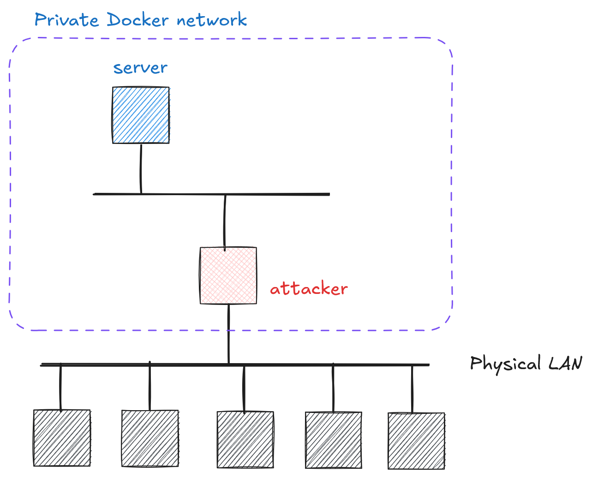

# Cryptography and Network Security <!-- omit in toc -->

# Lab 7: Establishing secure channel using asymmetric cryptography

## Introduction

The student will implement the security protocol shown below. The protocol essentially implements the _Diffie-Hellman key exchange protocol_ and enables the establishment of a shared symmetric key between two entities (client and server). The protocol uses the RSA cryptosystem to protect the integrity of Diffie-Hellman public keys. The established symmetric key is used to protect the confidentiality of the _challenge_.

>**DISCLAIMER: _In this form, the protocol is NOT secure. The shown protocol is intended for educational purposes only._**

Although the shown protocol is not secure, the basic principles used in the protocol approximately show the process that takes place when establishing, for example, HTTPS/TLS and SSH secure channels.

## Protocol for establishing a shared key

List of notations in the protocol:

| Notation                               | Description                                                     |
| -------------------------------------- | :-------------------------------------------------------------- |
| C                                      | client (student/this computer)                                  |
| S                                      | server (_crypto oracle_)                                        |
| RSA<sub>priv</sub>, RSA<sub>pub</sub>  | private and public RSA keys                                    |
| DH<sub>priv</sub>, DH<sub>pub</sub>    | private and public DH keys                                     |  |
| DH<sub>params</sub>                    | public DH parameters: _prime modulus_ (p) and _group generator_ (g) |
| **Sig**(RSA<sub>priv</sub></sub>, _m_) | RSA digitally signed message _m_                               |
| `shared_secret`                        | shared DH secret (i.e., g<sup>xy</sup> mod p)                  |
| K                                      | Symmetric key derived from `shared_secret`                      |
| **AES-256-CBC**(K, _m_)                | encryption of message _m_ with key K in AES-CBC mode           |
| _a_ \|\| _b_                           | concatenation of messages _a_ and _b_                          |

### Protocol <!-- omit in toc -->

| Who sends | Message being sent                                                                                                              |
| :--------: | :-------------------------------------------------------------------------------------------------------------------------------- |
| C &rarr; S | RSA<sub>pub,C</sub>                                                                                                               |
| S &rarr; C | RSA<sub>pub,S</sub>, DH<sub>params</sub>                                                                                          |
| C &rarr; S | DH<sub>pub,C</sub> \|\| **Sig**(RSA<sub>priv,C</sub></sub> , DH<sub>pub,C</sub>)                                                  |
| S &rarr; C | DH<sub>pub,S</sub> \|\| **Sig**(RSA<sub>priv,S</sub></sub> , DH<sub>params</sub> \|\| DH<sub>pub,S</sub> \|\| DH<sub>pub,C</sub>) |
| S &rarr; C | **AES-256-CBC**(K, "... crypto{your_flag} ...")                                                                                        |

> Note that the challenge in the last message is not authenticated; we do not protect its integrity. In practice, along with confidentiality, you would want to protect the message integrity as well.

The client (C) and server (S), after successfully exchanging the corresponding messages, verify the digital signatures, then derive the shared Diffie-Hellman secret `shared_secret`, and from this secret derive a 256-bit AES key K which is used to encrypt the student's `flag` (in CBC mode). The key K is derived from the `shared_secret` value using the [_hash-based key derivation function_](https://cryptography.io/en/latest/hazmat/primitives/key-derivation-functions/?highlight=hkdf) (HKDF) function.

## Network Topology

<p align="center">
  
</p>

## Challenge Description

Implement the protocol above to discover your `flag`. The challenge in phases: `exchange_RSA_keys` ⇒ `exchange_signed_DH_keys` ⇒ `shared_secret` ⇒ **`AES key`** ⇒ `flag`.

## Hint

1. `ssh -L 80:server:80 your_name@your_attacker_IP` and check detailed REST API documentation using `http://localhost/docs`
2. Check relevant parts of the source code used to prepare this challenge: [`code/secure_channel/`](../code/secure_channel/)
3. Pay attention to encoding of messages exchanged with the server.
4. We use Python [cryptography library](https://cryptography.io) for all crypto operations; here you can find details of [asymmetric crypto primitives](https://cryptography.io/en/latest/hazmat/primitives/asymmetric/).
5. Some public key parameters:
    - RSA and DH key size is 2048 bit
    - RSA public exponent is 65537
    - DH group generator is 2
6. To derive the final decryption key we use the following [_hash-based key derivation function_](https://cryptography.io/en/latest/hazmat/primitives/key-derivation-functions/?highlight=hkdf)
    ```python
    key = HKDF(
        algorithm=hashes.SHA256(),
        length=32,
        salt=b"ServerClient",
        info=None
    ).derive(shared_secret)
    ```