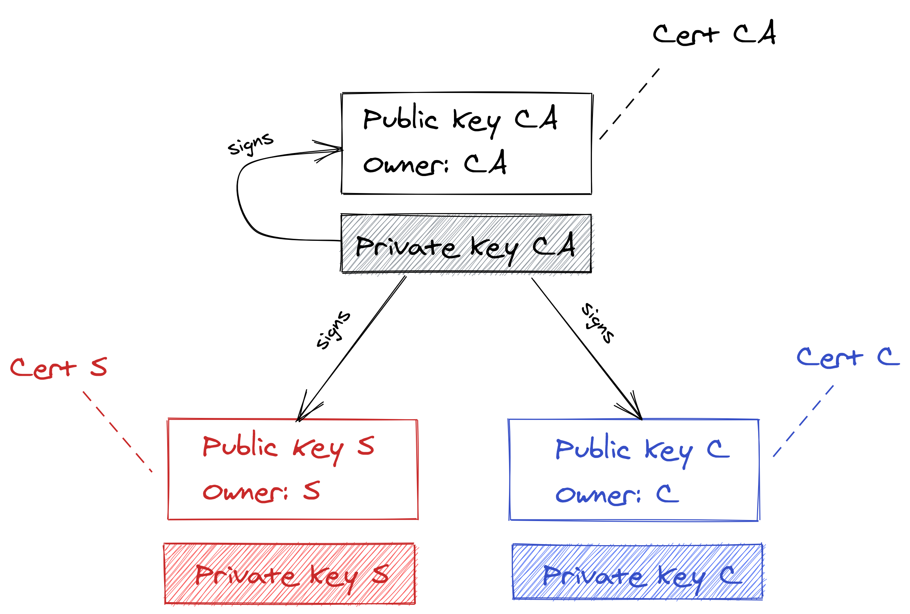
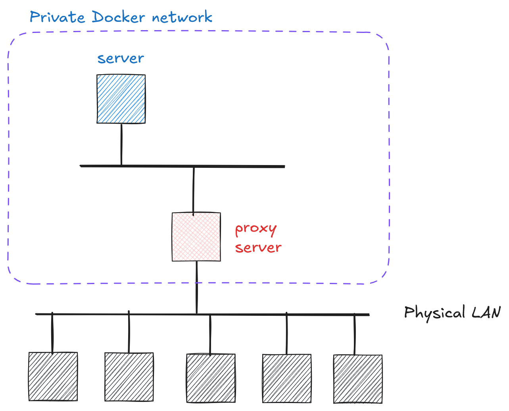
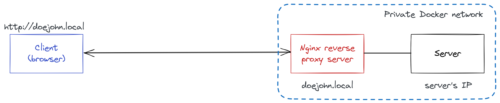
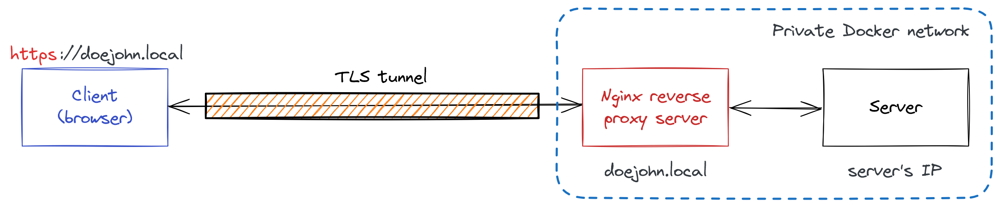

# Cryptography and Network Security <!-- omit in toc -->

# Lab 9: TLS protocol, certificates and reverse proxy

## Introduction

> Note: There are many details in this lab. However, the basic concept is simple and revolves around building a trust between the client and the server using a trusted third party (the CA). The CA is responsible for issuing certificates that bind a public key to an entity (the server or the client). The client and server can then use these certificates to establish a secure connection using the TLS protocol.
>
> Remember that TLS protocol is used everywhere. It is a cornerstone of secure communication on the intranet and the Internet.

In this lab, students will secure access to a web server using the TLS protocol. The goal is to establish a secure channel between the web browser and the server, ensuring the following security services: _confidentiality_, _data and origin integrity_, and protection against _replay_ attacks.

The lab will also demonstrate the use of the TLS protocol for mutual authentication between the server and the client. We will show how to leverage TLS for client authentication using certificates.

Certificate-based authentication requires the generation and management of several types of certificates (in x509 format): a _**root certificate authority (CA)**_ certificate (_**Cert CA**_), a TLS server certificate (_**Cert S**_), and a TLS certificate (_**Cert C**_). For our purposes, we will implement a simple certificate architecture as shown in the figure below. The CA certificate will be self-signed, while the server and client certificates will be signed by the CA.

> IMPORTANT: Convince yourself that you understand the technical underpinnings of the shown certificate hierarchy, that is, what it means for a certificate to be signed/self-signed, and how the CA certificate is used to sign the server and client certificates. You will need this knowledge both for the exam and in real (professional) life.

<p align="center">

<br>
<em>Certificate hierarchy</em>
</p>

## Network topology

<p align="center">
  
</p>

The `server` implements the following two endpoints:

1. Public path:
   - `/tls/public`

2. Protected path:
   - `/tls/protected`: Returns an HTML page with your final `flag`. This endpoint is accessible only if TLS-based client authentication is properly configured, which requires the client to present a valid TLS certificate signed by the Cert CA (see the cert hierarchy above). If authentication fails (e.g., due to an invalid or missing certificate), the server will deny access to this endpoint.

## Detailed instructions

### A high-level overview

Looking at the network architecture below, our goal is to secure the connection between the client and the server using the TLS protocol/tunnel. For this purpose, we will use a reverse proxy server. A _reverse proxy_ server (in our case, [NGINX](https://www.nginx.com)) is optimized for the TLS protocol, and we will shift the _responsibility_ for handling the computationally intensive TLS protocol to it (as shown in the images below).

<p align="center">

<br>
<em>(Withouth TLS) Insecure access</em>
</p>

<p align="center">

<br>
<em>(With TLS) Securing access to the server by hiding it behind a reverse proxy</em>
</p>

### Step 1: Check the reverse proxy is up and running

Make sure that your instance of a reverse proxy is up and running. For this, open a web browser and enter the following url: `http://<yourname>.local`.
   > For example, if your username is normally `doe_john` then use the following url: `http://doejohn.local`.

### Step 2: Initial configuration of the reverse proxy

1. Eventually, you will need to edit the configuration files on the reverse proxy. For this, we propose to use Visual Studio Code (VSCode) with the [Remote - SSH](https://code.visualstudio.com/docs/remote/ssh) extension. This will allow you to edit the files directly on the remote server without having to copy them back and forth (as if you are editing files on your local machine). Please check carefully [the instructions titled "Connect to a remote host" on how to set up VSCode with the Remote - SSH extension](https://code.visualstudio.com/docs/remote/ssh#_connect-to-a-remote-host).

      > IMPORTANT: Make sure you have the `Remote - SSH` extension installed in VSCode before proceeding. Also, do not hesitate to ask the instructor for help if you have any issues with the setup.

      To authenticate you will use your usual username (e.g., `doe_john`) and password/flag discovered in the previous lab.

2. Once successfully connected to the remote reverse proxy, open a folder `/etc/nginx/conf.d` in VSCode. This is the main configuration folder for NGINX.

3. Create a new file in this folder with an arbitrary name and and mandatory extension `.conf`.

    ```bash
    # Assuming you are "doe_john" you could name it:
    doejohn.local.conf    
    ```

   > Note: The name of the file does not matter, but it is a good practice to use your domain name as the reverse proxy can handle multiple domains/subdomains.  

    > IMPORTANT: If you run into issues with permissions when creating or modifying files, you can install the following VSCode extension: [Save as Root in Remote - SSH](https://marketplace.visualstudio.com/items?itemName=yy0931.save-as-root). Alternatively, check with the professor.

4. Next, copy the following template configuration to the your configuration file (e.g., to `doejohn.local.conf`) and update the fields marked with `<...>`.

    ```bash
    server { # simple reverse-proxy
        listen  80;

        # replace <yourname> with your name :-) (notice: without underscore)
        server_name  <yourname>.local;

        proxy_set_header  Host             $host;
        proxy_set_header  X-Real-IP        $remote_addr;
        proxy_set_header  X-Forwarded-For  $proxy_add_x_forwarded_for;

        # pass requests to your server.
        # lookup your server IP address and replace <server_IP_address> (`ping server` from the reverse proxy should work)
        location / {
            proxy_pass  http://<server_IP_address>:80;
        }
    }    
    ```

    > Hint: You can open a terminal in VSCode by going to the menu `Terminal -> New Terminal`. You can then use the `ping` command to find out the IP address of the server.

5. Save the new configuration file and test its correctness by running the following command (in the terminal in VSCode):

    ```bash
    sudo nginx -t
    ```

6. Disable the default pre-configured Nginx virtual host (in the terminal in VSCode) by running:

    ```bash
    sudo unlink /etc/nginx/sites-enabled/default
    ```

7. Finally, restart the NGINX reverse proxy by running:

    ```bash
    sudo service nginx reload
    ```

8. To test that everything has been set up correctly, open a web browser on your local machine and test the following urls:
   - [ ] `http://<yourname>.local`
   - [ ] `http://<yourname>.local/tls/public`
   - [ ] `http://<yourname>.local/tls/protected`

Congratulations, you have successfully configured a reverse proxy!

### Step 3: Generate the necessary certificates for TLS

Now that the reverse proxy is up and running, we need to configure it to use TLS protocol to authenticate server and secure communication between the client/browser and the server/reverse proxy. For this, we will first need to generate the necessary certificates.

1. Hereafter you can find a simple bash script that will generate the necessary public/private key pairs and public-key certificates (as per hierarchy shown in the first image above). **Carefully update the script with your name (e.g., `John Doe`) and domain name for the server (e.g., `doejohn.local`)**.
  
2. Copy the updated script and save it as `generate_certs.sh` in your home directory on the reverse proxy server. Make sure to give it execution permissions by running `sudo chmod +x generate_certs.sh`. Call it as `sudo ./generate_certs.sh` from the terminal to finally generate the required keys and certificates.

    ```bash
      #!/bin/bash

      # Create directories to keep things organized
      mkdir -p ca server client
      cd ca

      # Step 1: Generate the Root CA private key (RSA 2048-bit for simplicity)
      openssl genrsa -out ca.key 2048

      # Step 2: Create a self-signed Root CA certificate (valid for 5 years)
      openssl req -x509 -new -nodes -key ca.key -sha256 -days 1825 \
          -out ca.crt \
          -subj "/C=HR/ST=Dalmatia/L=University of Split/O=FESB/CN=RootCA"

      # Step 3: Generate the Server private key (RSA 2048-bit)
      openssl genrsa -out ../server/server.key 2048

      # Step 4: Create a Certificate Signing Request (CSR) for the Server
      openssl req -new -key ../server/server.key -out ../server/server.csr \
          -subj "/C=HR/ST=Dalmatia/L=University of Split/O=FESB/CN=doejohn.local"

      # Step 5: Sign the Server CSR with the Root CA to create the Server certificate
      openssl x509 -req -in ../server/server.csr -CA ca.crt -CAkey ca.key \
          -CAcreateserial -out ../server/server.crt -days 365 -sha256

      # Step 6: Generate the Client private key (RSA 2048-bit)
      openssl genrsa -out ../client/client.key 2048

      # Step 7: Create a CSR for the Client
      openssl req -new -key ../client/client.key -out ../client/client.csr \
          -subj "/C=HR/ST=Dalmatia/L=University of Split/O=FESB/CN=John Doe"

      # Step 8: Sign the Client CSR with the Root CA to create the Client certificate
      openssl x509 -req -in ../client/client.csr -CA ca.crt -CAkey ca.key \
          -CAcreateserial -out ../client/client.crt -days 365 -sha256

      # Clean up temporary files
      rm ../server/server.csr ../client/client.csr

      echo "Certificate hierarchy created successfully!"
      echo "Files are in the following directories:"
      echo "- CA: ca/ca.key, ca/ca.crt"
      echo "- Server: server/server.key, server/server.crt"
      echo "- Client: client/client.key, client/client.crt"
    ```

### Step 4: Update the NGINX configuration to use TLS protocol

1. Update a reverse proxy to support TLS protocol. For this adjust the configuration file (e.g., `doejohn.local.conf`) from the initial phase as follows:

    ```bash
    server { # simple reverse-proxy
        listen  80;
        listen  443 ssl;

        # replace <yourname> with your name :-) (notice: without underscore)
        server_name  <yourname>.local;

        # server certificate and private key
        ssl_certificate            /<path>/server.crt;
        ssl_certificate_key        /<path>/server.key;
        ssl_protocols              TLSv1.2;
        ssl_prefer_server_ciphers  on;
        ssl_ciphers                HIGH:!aNULL:!MD5;

        add_header 'Content-Security-Policy' 'upgrade-insecure-requests';

        proxy_set_header  Host             $host;
        proxy_set_header  X-Real-IP        $remote_addr;
        proxy_set_header  X-Forwarded-For  $proxy_add_x_forwarded_for;

        # pass requests to your server
        # lookup your server IP address and replace <server_IP_address>
        location / {
            proxy_pass  http://<server_IP_address>:80;
        }
    }   
    ```

2. For this configuration to work, you should carefully set the fields marked with `<...>`. In particular mind that you properly set `<path>` to appropriate certificates and private keys. Here you can find `pwd` command useful to print the currently working directory/path.

3. Save the new configuration file and test its correctness by running the following command:

    ```bash
    sudo nginx -t
    ```

4. Restart the reverse proxy by running:

    ```bash
    sudo service nginx reload
    ```

5. To test that everything has been set up correctly, open a web browser on your local machine and test the following url:
   - [ ] `https://<yourname>.local`
  
   > **IMPORTANT:** **Mind the new protocol specifier: `https`**.

6. If everything is set up correctly, you should see a warning in the browser that the certificate is not trusted. This is expected because we are using RootCA certificate to sign server certificate and RootCA is currently not trusted by your browser/operating system. To fix this you should add/install RootCA to the list of trusted CA certificates in your browser/operating system.

    Please check with ChatGPT how to do this for your specific browser/operating system. For example, in Chrome you can do this by going to `Settings -> Privacy and security -> Security -> Manage certificates -> Authorities` and then import the `RootCA.crt` file. After that, you should be able to access the page `https://<yourname>.local` without any warnings (possibly need to rerun Chrome). Note the lock icon in the address bar indicating a secure connection.

### Step 5: Configure TLS client authentication

The sought `flag` is located in the `/tls/protected` endpoint. This endpoint is protected and requires **TLS client authentication**. The server will check if the client (your browser) presents a valid TLS client certificate signed by the RootCA. If the client does not present a valid certificate, it will not be able to access the protected endpoint.

1. To enable TLS client authentication, you need to update the NGINX configuration file (e.g., `doejohn.local.conf`) as follows:

   ```bash
    server { # simple reverse-proxy
        listen  80;
        listen  443 ssl;

        # replace <yourname> with your name :-) (notice: without underscore)
        server_name  <yourname>.local;

        # server certificate and private key
        ssl_certificate            /<path>/server.crt
        ssl_certificate_key        /<path>/server.key
        ssl_protocols              TLSv1.2;
        ssl_prefer_server_ciphers  on;
        ssl_ciphers                HIGH:!aNULL:!MD5;

        # enable tls client authentication (possible values: on, off, optional)
        # also, specify trusted CA certificate used to verify client certificates
        ssl_verify_client       optional;
        ssl_client_certificate  /<path>/ca.crt;

        add_header 'Content-Security-Policy' 'upgrade-insecure-requests';

        proxy_set_header  Host             $host;
        proxy_set_header  X-Real-IP        $remote_addr;
        proxy_set_header  X-Forwarded-For  $proxy_add_x_forwarded_for;

        # pass requests to your server
        # lookup your server IP address and replace <server_IP_address>
        location / {
            proxy_set_header  X-SSL-Client-Cert-CN  $ssl_client_s_dn;
            proxy_pass  http://<server_IP_address>:80;
        }
    }   
    ```

2. Save the new configuration file, test its correctness, and restart the reverse proxy:

    ```bash
    sudo nginx -t

    # If everything is ok
    sudo service nginx reload
    ```

3. For TLS client authentication to work, you need to import the `client.crt` certificate and its private key into your browser. For this, you need to convert the `client.crt` and `client.key` files into a format that your browser can understand. The most common format is PKCS#12, which combines the certificate and private key into a single file.

   You can do this by running the following command on the reverse proxy server (from the `client` directory):

    ```bash
    openssl pkcs12 -export -out client.p12 -inkey client.key -in client.crt -certfile ../ca/ca.crt
    ```

   This will create a file named `client.p12`. You will be prompted to set a password for the file. Make sure to remember this password as you will need it when importing the certificate into your browser.

4. Import the `client.p12` file into your browser. This is similar to how you imported the RootCA certificate earlier. Again, please check with ChatGPT how to do this for your specific browser/operating system. For example, in Chrome you can do this by going to `Settings -> Privacy and security -> Security -> Manage certificates -> Your certificates` and then import the `client.p12` file.

5. Finally, get your `flag` by opening the following url in your browser:
   - [ ] `https://<yourname>.local/tls/protected`

   > **IMPORTANT:** **Mind the new protocol specifier: `https`**.

Congratulations! You made it 🎉
