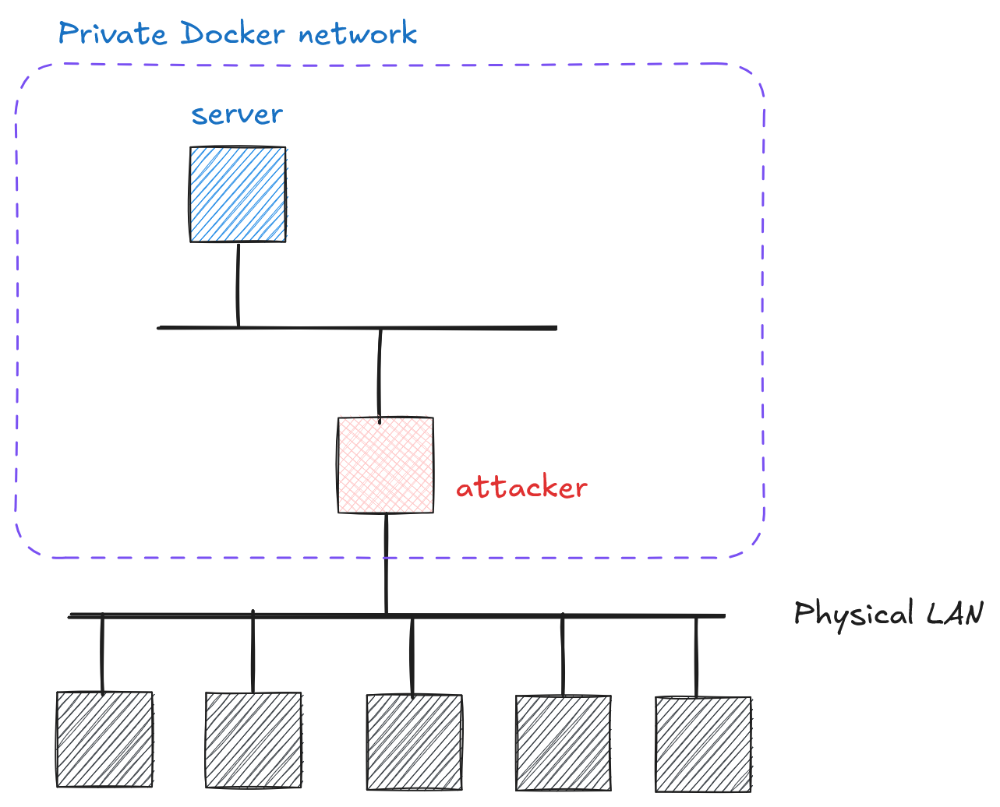

# Cryptography and Network Security <!-- omit in toc -->

# Lab 3: The Line Between Perfect and Broken Ciphers <!-- omit in toc -->

## Introduction

A Vernam cipher achieves perfect secrecy when:
- The key is truly random
- The key length equals or exceeds the message length
- Each encryption uses a new random key

Breaking any of these requirements compromises security, as demonstrated in this lab.

## Network Topology

The network topology for this lab is given in the image below. The server implements a simple REST API service providing Vernam cipher encryption:

  

The server implements Vernam cipher as shown in the image below ([`code/vernam/`](../code/vernam/)):

  

## Challenge Description

Your task: recover the flag by exploiting a **key vulnerability** - the server reuses the same key for all encryptions.

> **Chosen-Plaintext Attack (CPA)**
>
> Attack steps:
>   1. Choose and submit a plaintext to the server
>   2. Server encrypts your message
>   3. Analyze the returned ciphertext

This models real scenarios where attackers can trick systems into encrypting known data.

## Hints

1. Make sure you understand how the server processes the `flag` (check the source code in [`code/vernam/`](../code/vernam/)). Ask your favorite LLM to briefly explain the relevant parts of the code.      
2. Try this: `ssh -L 80:server:80 your_name@your_attacker_IP` and `http://localhost/docs`. 
3. Think carefully what happens when you XOR two or more binary values (A ⊕ B, A ⊕ B ⊕ C).
4. **Chosen-Plaintext Attacks (CPA)**.
5. [CyberChef](https://gchq.github.io/CyberChef/) can be quite useful (in particular blocks `From Hex` and `XOR`).